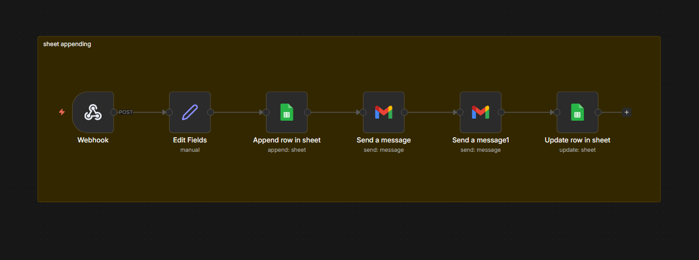

# Progress Spark - World Wide Progress

## Project Overview

Landing page for World Wide Progress, a recruitment consultancy in Morocco. Built with modern web technologies for optimal performance and user experience.

## Technologies

This project is built with:

- **Vite** - Fast build tool and dev server
- **React 18** - UI framework
- **TypeScript** - Type-safe JavaScript
- **shadcn/ui** - High-quality UI components
- **Tailwind CSS** - Utility-first CSS framework

## Getting Started

### Prerequisites

- Node.js 18+ and npm installed - [install with nvm](https://github.com/nvm-sh/nvm#installing-and-updating)

### Installation

```sh
# Clone the repository
git clone <YOUR_GIT_URL>

# Navigate to the project directory
cd progress-spark

# Install dependencies
npm install

# Start the development server
npm run dev
```

The application will be available at `http://localhost:8080`

## Available Scripts

```sh
npm run dev      # Start development server
npm run build    # Build for production
npm run preview  # Preview production build
npm run lint     # Run ESLint
```

## Project Structure

```
src/
├── components/
│   ├── landing/     # Landing page sections
│   └── ui/          # shadcn/ui components
├── contexts/        # React contexts
├── hooks/           # Custom React hooks
├── lib/             # Utility functions
├── pages/           # Page components
└── assets/          # Static assets
```

## Deployment

Build the project for production:

```sh
npm run build
```

The built files will be in the `dist/` directory, ready to be deployed to any static hosting service.

## Contributing

1. Create a feature branch
2. Make your changes
3. Run `npm run lint` to check for issues
4. Commit and push your changes
5. Create a pull request

## n8n Workflow (Form → Sheet → Emails)

This project includes an n8n workflow that the front-end form posts to. The workflow accepts the form POST at the webhook path `/webhook/wwpformdetails`, extracts the body, appends the data to a Google Sheet, notifies admins by email, sends a confirmation email to the lead, and updates the sheet status.

Files
- `n8n/workflows/wwpl.sanitized.json` — sanitized exported workflow (credentials removed). Import this in the n8n Editor (Import → upload JSON) or with the CLI:

```bash
n8n import:workflow --input=n8n/workflows/wwpl.sanitized.json
```

Important notes
- The sanitized JSON replaces sensitive IDs/URLs with placeholders (`<GOOGLE_SHEET_ID>`, `<GOOGLE_SHEET_URL>`, `<ADMIN_EMAILS_COMMA_SEPARATED>`). Do NOT commit real credentials.
- After importing, create or configure credentials in your n8n instance (Google Sheets OAuth, Gmail OAuth) and update the workflow to use them.
- If your hosted n8n instance auto-syncs with this repo, pushing changes to the workflow file can update the running workflow — use branches/PRs and test in staging before merging to `main`.

Screenshot

Below is the n8n workflow screenshot for reference (stored in the repo assets). It shows the webhook -> set (edit fields) -> append sheet -> admin email -> auto-reply -> update sheet flow.



